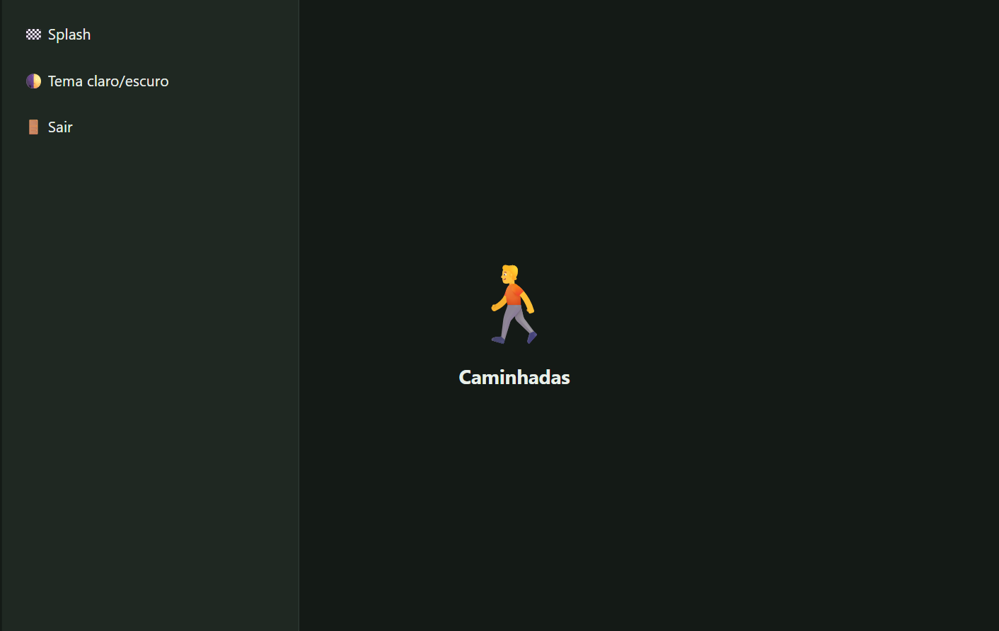
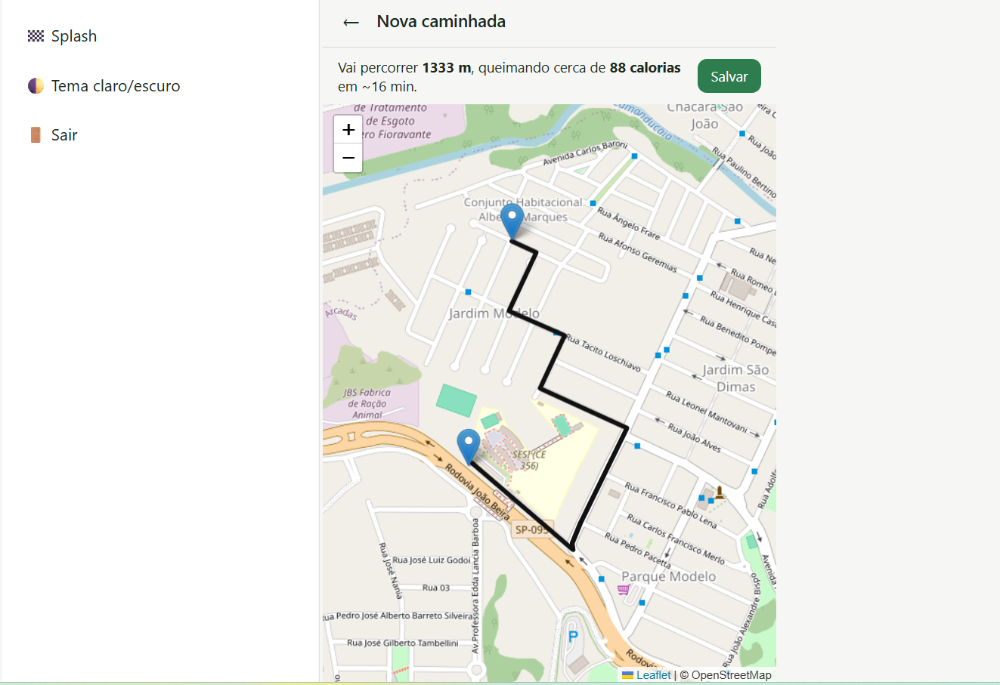
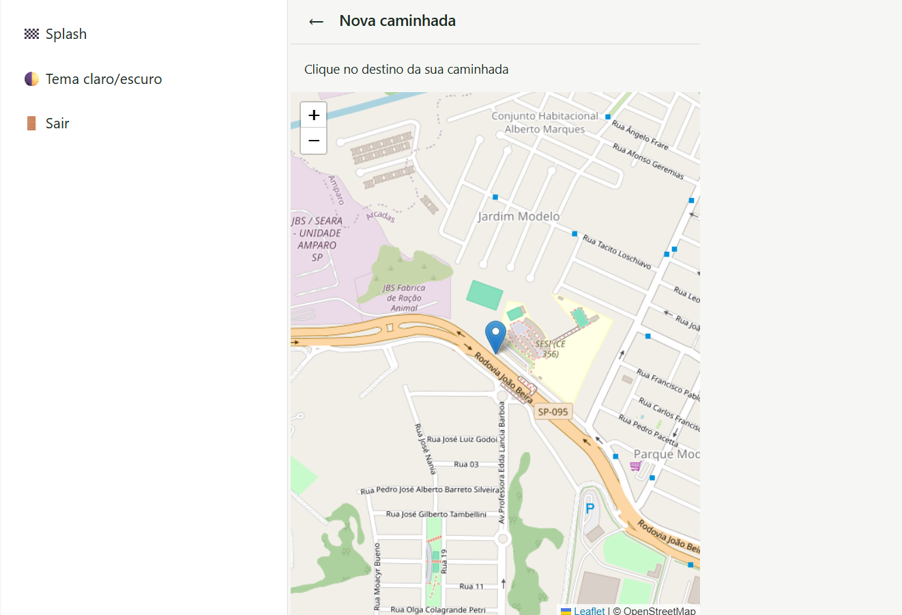
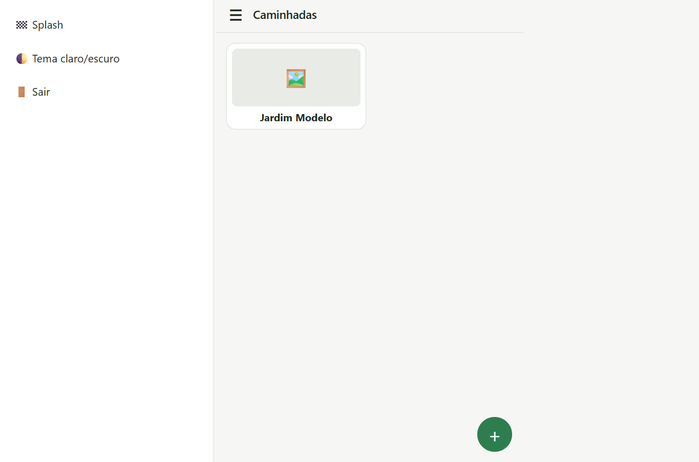
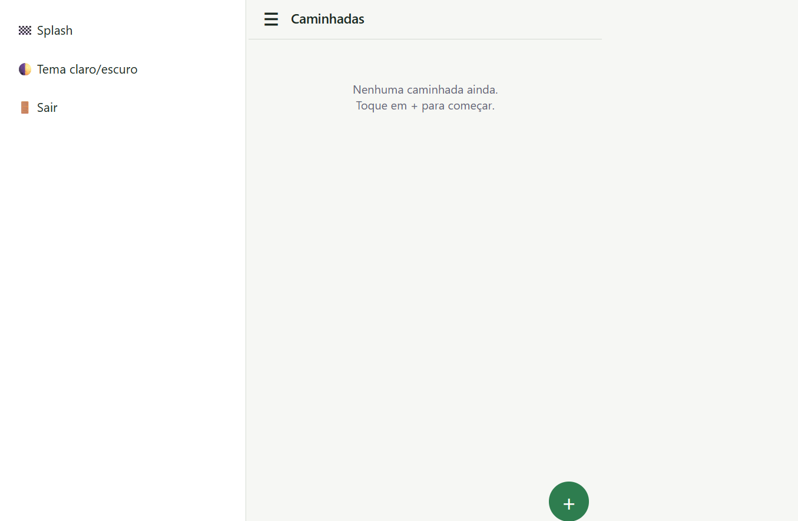

# Desafio APP Caminhadas

| | |
|---|---|
| **Instituição** | SENAI |
| **Curso** | Técnico em Desenvolvimento de Sistemas |
| **Unidade curricular** | SESI CE 356 |
| **Atividade** | Desafio APP Caminhadas |
| **Aluno** | Matheus Guilherme Teixeira Silva |
| **Turma** | 3B |
| **Professores** | Wellington |
| **Data** | 07/10/2026 |

---
# App Caminhadas

Aplicativo para registrar e acompanhar caminhadas, com mapa, rota, cálculo de calorias, foto e armazenamento local.

## Funcionalidades
- Splash com animação de entrada e saída
- Home com menu lateral (Splash, tema claro/escuro e Sair)
- Nova caminhada: escolha o destino no mapa e veja o trajeto, a distância, as calorias e o tempo
- Salvar a caminhada com título (localStorage)
- Detalhes com mapa, dados e foto tirada pela câmera

## Telas

---

---

---

---

---

## Tecnologias
HTML, CSS, JavaScript, Leaflet, OpenStreetMap e Geolocation API.

## Como rodar
1. Clone o repositório: `git clone https://github.com/MatheusGuilherme25088/Desafios_App_Caminhadas.git`
2. Abra a pasta no VS Code.
3. Rode o `index.html` com a extensão **Live Server**.

